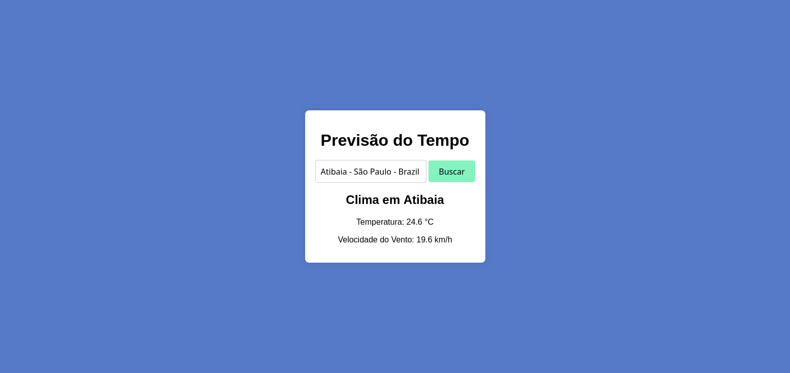
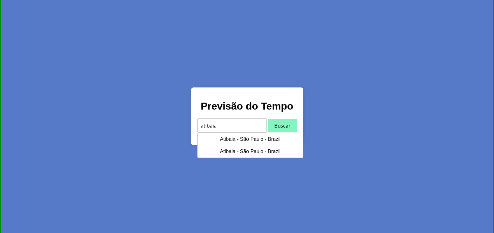

# Projeto Clima - Protótipo

Um aplicativo web simples que permite inserir o nome de uma cidade e obter informações meteorológicas atuais, como temperatura e velocidade do vento. O app consome dados de uma API de clima em tempo real.

## Tecnologias

- HTML
- CSS
- JavaScript
- API de busca e clima (OpenStreetMap & Open-Meteo)
## Funcionalidades

- Entrada do nome da cidade pelo usuário
- Requisição à API para obter dados do clima
- Exibição de temperatura e vento na tela
- Protótipo simples para fins de demonstração

## Como usar

1. Abra o arquivo `index.html` no navegador.
2. Digite o nome da cidade desejada.
3. Clique em "Buscar" e visualize os dados do clima.

## Observações

- Este é um protótipo básico, sem tratamento avançado de erros ou validações.
- Requer conexão com a internet para acessar a API de clima.
